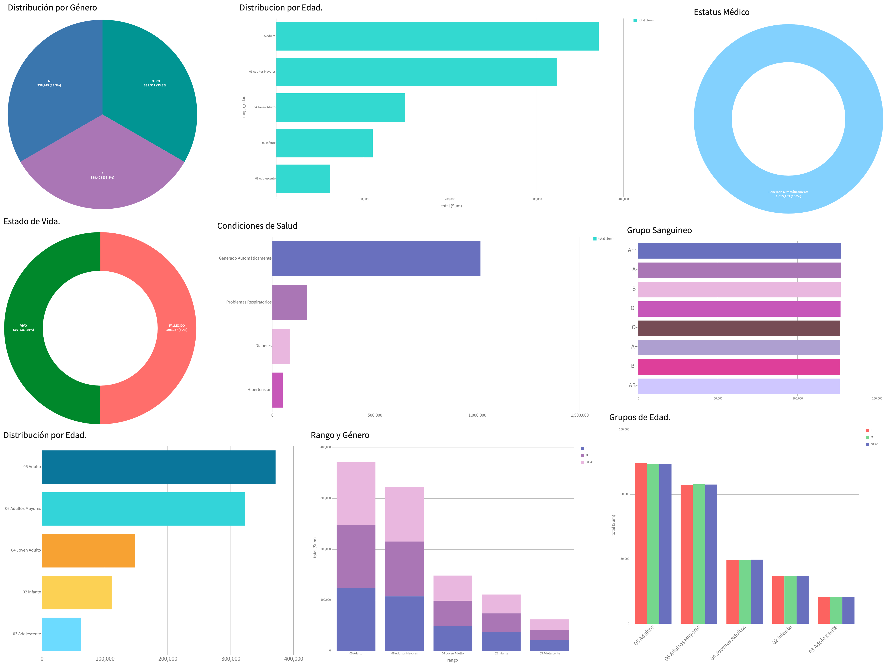

# 🏥 Dashboard de Gestión Hospitalaria

Un panel de control interactivo de Business Intelligence (BI) diseñado para analizar y visualizar datos clínicos y demográficos a gran escala. Este proyecto procesa, agrupa y grafica información de **más de 1,000,000 de registros de pacientes** en tiempo real.

## 🚀 Características y KPIs Analizados
El dashboard proporciona una vista panorámica de la situación del hospital a través de las siguientes métricas:

* **Visión General (KPIs):** Tarjetas de indicadores con el total de pacientes registrados, pacientes internos, ambulatorios y expedientes deshabilitados.
* **Distribución Demográfica:** Gráficos de pastel y barras horizontales mostrando la proporción de género y rangos de edad calculados dinámicamente (desde Neonatos hasta Adultos Mayores).
* **Análisis Clínico y de Urgencia:** Gráficos de dona detallando el Estado Médico actual (Estable, Crítico, Crónico) y el Estado de Vida.
* **Grupos de Edad por Género:** Gráfico de barras agrupadas para comparar la demografía exacta de manera cruzada.
* **Condiciones de Salud y Grupos Sanguíneos:** Visualización detallada de los padecimientos predominantes y la distribución de tipos de sangre.

## 🛠️ Tecnologías Utilizadas
* **Base de Datos:** MySQL (Arquitectura y gestión de +1 millón de registros).
* **Herramienta de BI:** Navicat Premium / Navicat Charts.
* **Lenguaje:** Consultas SQL estructuradas y optimizadas (uso de `CASE`, `TIMESTAMPDIFF`, `UNION ALL`, `GROUP BY`, y funciones de agregación).

## 📂 Estructura de Datos (Data Sources)
El dashboard se alimenta de una base de datos relacional orientada a la gestión clínica, extrayendo información procesada de tablas clave como:
* `tbb_pacientes`: Control de estatus médico, nivel de urgencia y estado vital.
* `tbb_personas_fisicas`: Datos demográficos generales, cálculo de edades mediante fechas de nacimiento y género.
* `tbb_personas`: Identificadores únicos y control de estatus de expedientes.

## ⚙️ Cómo visualizar este proyecto
Para interactuar con el Dashboard en tu entorno local:

1. Clona este repositorio en tu máquina.
2. Abre **Navicat Premium** (versión con soporte para la herramienta de *Charts* o *BI*).
3. Importa el archivo de espacio de trabajo `*.nbi` incluido en esta carpeta.
4. Asegúrate de tener activa la conexión a la base de datos origen para que las consultas (*Queries*) se ejecuten correctamente y rendericen los gráficos actualizados.